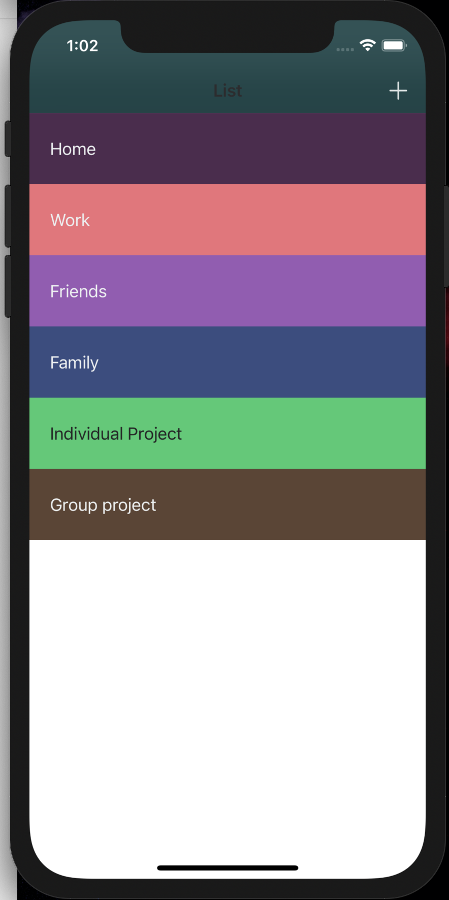
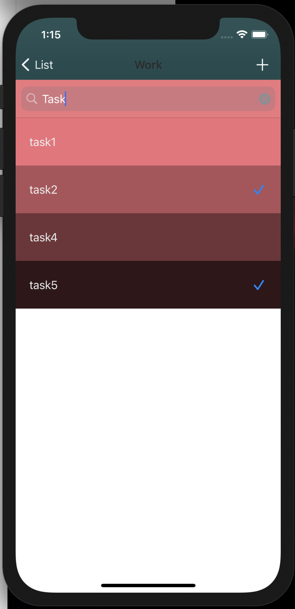
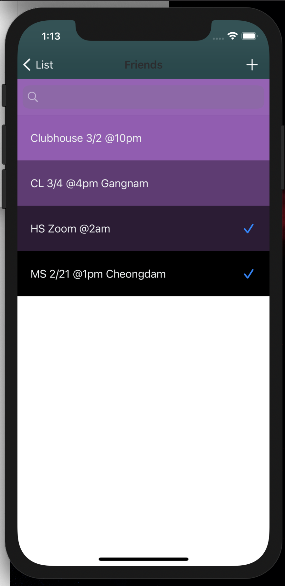

# todoList

## Features

  <a href="https://youtu.be/8q9Jh-q6IxM">
  
Click here to watch Todo App

  </a>
    

  
  
  
 

 TodoList is an app that saves and organizes categorie-tasks to remember reminders in the item 
 
<li>Items by Category</li>
<li>Done/undone checklist capabilities</li>
<li>Search capabilities</li>
<li>Swipe delete capabilities</li>

 
## Requirements

- iOS 9.0+ 
  

## Dependencies
<li>Data presistence - Realm</li>
<li>Deletion Interface - SwipeCell Kit</li>
<li>Color Palette - Chameleon module </li>
